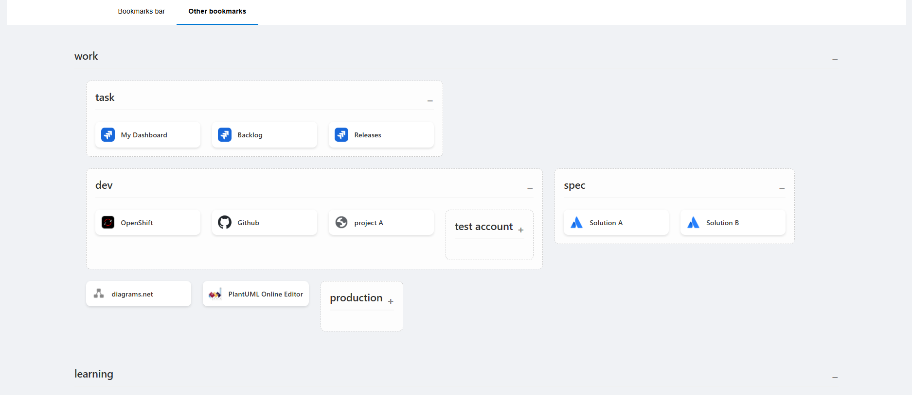

# Cardmark

A Chrome extension that displays your bookmarks in a card-based layout for a more visual experience.

## How to Use

1. **Clone or download this repository.**
2. **Open Chrome and navigate to `chrome://extensions`**.
3. **Enable "Developer mode"** in the top right corner.
4. Click on **"Load unpacked"**.
5. Select the directory where you cloned or downloaded this repository.

The extension will now be active. When you click the extension icon, you will see your bookmarks displayed as cards with/wo group (if your bookmark folder sturcture contains nested folder).

### How To Manage Bookmarks

To add, remove, rename, or organize your bookmarks into different groups (folders), please use Chrome's built-in Bookmark Manager (`chrome://bookmarks`). Any changes you make there will be reflected in Cardmark.